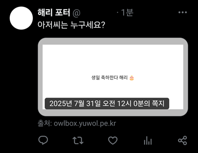
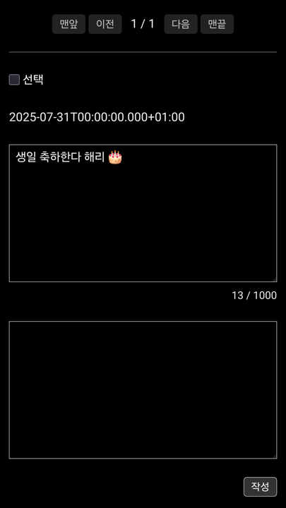
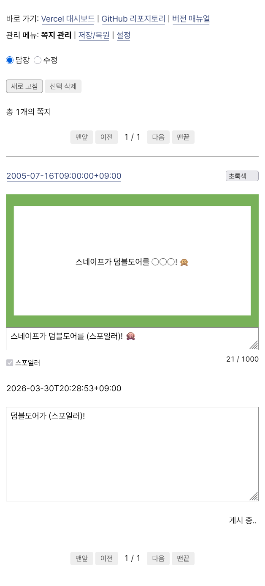

<!--
Copyright 2025 Ju Yuwol <ju@yuwol.pe.kr>
SPDX-License-Identifier: CC0-1.0
-->

# 부엉이 사서함 — OwlBox

나만의 익명 쪽지함 겸 답장 게시판을 만들어 보세요.

- 받은 쪽지의 내용을 ([스핀스핀](https://spin-spin.com/), [페잉](https://peing.net/) 외 동종 서비스들처럼) 이미지 섬네일로 공유할 수 있습니다.
   - 이모지 출력이 가능합니다.
   - 대체 텍스트(이미지 설명, ALT)가 지원됩니다.
   - 섬네일의 테두리, 색, 글꼴 등을 커스터마이징할 수 있습니다.
   - 내용 중 스포일러가 되는 부분을 숨김 처리할 수 있습니다.
- 쪽지가 왔을 때 이메일 알림을 받을 수 있습니다.
- **일시적으로 쪽지를 받지 않도록 설정할 수 있습니다.** 과열된 관심을 피해야 할 때 메시지함 전체를 삭제하지 않아도 됩니다.
- **필요 시 쪽지 작성자의 IP 주소를 확인할 수 있습니다.** 그 가능성만으로도 준수한 악플 예방책이 됩니다.
- 데이터의 보존과 관리가 자유롭습니다. 페잉처럼 오래된 답변이 자동 삭제되지 않습니다.
- 설치 및 운영에 별도의 금전적 비용이 들지 않습니다.
- 프로그래밍과 웹 기술에 대해 잘 몰라도 설치와 운영이 가능합니다.

개발 배경에 대해서는 포스타입에 발행한 [사설 익명함 운영기](https://www.postype.com/@juyuwol/post/19894502)에서 밝히고 있습니다.

## 미리 보기

| 답장 작성 | 발행 |
| --- | --- |
|  |  |

아래의 데모 사이트에서 쪽지 보내기, 답장 작성·수정·삭제, 설정 변경 등 실사용 시의 동작을 자유롭게 체험할 수 있습니다.

- [쪽지 보내기](https://owlbox.yuwol.pe.kr/)
- [쪽지 관리](https://owlbox.yuwol.pe.kr/box/)
  - 사용자 이름: `dumbledore`
  - 비밀번호: `sherbet-lemon`

## 매뉴얼

- [설치 안내](docs/install.md)
   - 프로젝트 생성
   - 이메일 연동
- [사용 안내](docs/usage.md)
   - 답장 작성 및 설정 변경
   - IP 주소 확인 및 데이터 백업
   - 파일 업로드
   - 아이콘 변경
   - 카드 이미지 커스터마이징
   - 레이아웃 커스터마이징
   - 개발 환경 구축

## 라이선스

© 2025 주유월 \<ju@yuwol.pe.kr>

기본적으로 [zlib 라이선스](LICENSE.txt)를 따릅니다. 일부 코드에는 [BSD Zero Clause 라이선스](LICENSES/0BSD.txt)가 적용됩니다. 각 소스 파일 상단의 주석에서 해당 파일의 라이선스 정보를 확인할 수 있습니다.

포함된 글꼴 소프트웨어의 저작권은 파일명에 '.license'가 덧붙은 인접 파일을 통해 고지됩니다. 별도의 언급이 없다면 소프트웨어가 아닌 파일에는 [CC0 1.0 라이선스](https://creativecommons.org/publicdomain/zero/1.0/)가 적용됩니다.

모든 라이선스의 전문은 [LICENSES 디렉토리](LICENSES/)에 있습니다.

## 기여 및 문의

버그 제보, 개선점과 기능 제안, 문서 및 코드 기여는 물론, 사소한 사용상의 질문을 포함한 모든 형태의 기여와 문의를 환영합니다.

이슈나 풀 리퀘스트를 개설하셔도 되고, 아래의 개발자 연락처로 말씀 주셔도 좋습니다. 확인은 개인 연락처 쪽이 빠릅니다.

- 이메일 <ju@yuwol.pe.kr>
- [트위터 @JuYuwol](https://x.com/JuYuwol)
- [주유월 사서함](https://ask.yuwol.pe.kr/) (이 프로젝트의 모태 ✨)
