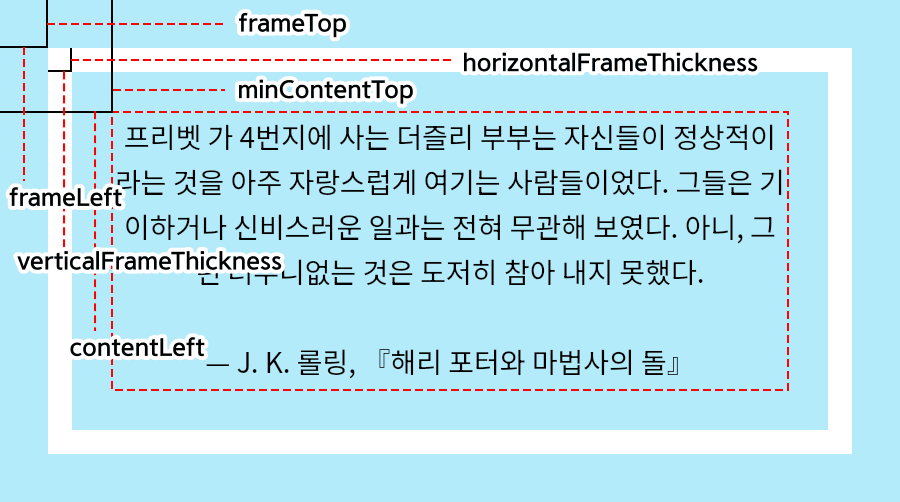

<!-- © 2025 주유월 <ju@yuwol.pe.kr> -->
<!-- SPDX-License-Identifier: CC0-1.0 -->

# 사용 안내

## 답장 작성 및 설정 변경

쪽지에 대한 답장을 작성해 전송하면, 그 직후 사이트 전체가 재생성(빌드)되며, 이 과정에서 15~20초가량의 지연이 생깁니다. 이는 시스템의 본원적 특성으로, 대기업들의 관대한 무료 정책을 뽑아먹으며 유지비용을 제로로 만들기 위한 불가피한 제약입니다. 😇

작성한 답장의 수정·삭제와 설정 변경 작업 또한, 전송 후 사이트가 갱신되기까지 동일한 지연이 발생합니다.

빌드 현황은 Vercel 프로젝트 대시보드의 *Deployments* 메뉴에서 확인할 수 있습니다. 만약 계속 갱신이 되지 않는다면 서버의 문제일 수 있으니 Vercel 대시보드에서 상태를 확인해 보세요.

이렇게 사이트를 갱신하는 **빌드의 횟수에는 제한이 존재합니다**. (다만 어지간해선 초과하기 어려운, 상당히 넉넉한 한도이므로 크게 걱정하실 필요는 없습니다.)

호스팅사인 Vercel의 정책에 따라, 무료 계정은 **1시간 내 32회, 24시간 내 100회**까지의 배포(deployment: 빌드의 결과) 생성이 가능합니다. (2026년 3월 30일 기준) 최신의 정확한 정보는 [Vercel 공식 Limits 문서](https://vercel.com/docs/limits)에서 확인해 주세요.

## IP 주소 확인 및 데이터 백업

쪽지 작성자의 IP 주소는 웹 UI상에서 노출되지 않으며, ‘저장/복원’ 메뉴에서 내려받은 데이터상으로만 확인 가능합니다. 익명성에 대한 신뢰도를 위해 정말 필요한 상황에서만 확인합시다.

**쪽지에 답장을 작성하면 IP 주소 데이터가 소실됩니다.** 필요 시 답장을 작성하기 전에 미리 데이터를 내려받아 보존할 수 있습니다.

내려받거나 불러올 수 있는 ‘답장을 기다리는 쪽지 목록’ 데이터는 한 줄당 쪽지 하나의 데이터가 있는 [JSON Lines](https://jsonlines.org/) 파일입니다.

개별 쪽지 데이터는 다음과 같은 형식입니다.

``` json
{
  "id": "eb73h1c00",
  "sent": "2005-07-16T00:00:00+00:00",
  "ip": "192.0.2.0",
  "message": "스네이프가 덤블도어를 `죽였어`! 🙊",
  "color": "초록색",
  "spoiler": true
}
```

- `id`: 쪽지의 고유 식별자. 수신 시각에 대한 ‘epoch 시간(UTC 시간대에서의 1970년 1월 1일 정각)으로부터 경과한 밀리초’(JavaScript Date 객체의 단위)의 36진수 표기 뒤에 영숫자(`/[0-9a-z]/`) 1개 문자를 더한 형식입니다.

   맨 끝의 숫자는 수신 시각이 동일한 데이터끼리 식별자가 겹치는 것을 방지하기 위한 것입니다(예: 타 플랫폼에서 스크랩한 데이터를 옮길 때). 부엉이 사서함 시스템 내에서 생성된 쪽지의 경우, 일괄적으로 `0`만을 붙입니다. 이는 실질적으로 타임스탬프가 겹칠 가능성은 적은 반면 DB 조회에는 사용량과 시간이 소요되기 때문입니다.

   ``` javascript
   // epoch 시간으로부터 경과한 밀리초의 36진수 표기 뒤에 0 더하기:
   Date.parse('2005-07-16T00:00:00+00:00').toString(36) + '0'
   ```

- `sent`: 쪽지의 수신 시각. [RFC 3339](https://datatracker.ietf.org/doc/html/rfc3339#section-5.6)의 *date-time* 혹은 *full-date* 형식입니다. 단, `T`를 공백으로 대체하는 것은 허용되지 않습니다. 부엉이 사서함 시스템 내에서 생성된 쪽지의 경우, 항상 밀리초가 포함된 *date-time* 형식을 취합니다.

- `ip`: (선택) 쪽지 작성자의 IP 주소

- `message`: 쪽지 내용

- `color`: (선택) 테두리색

- `spoiler`: (선택) 스포일러 포함 여부. `true`일 시, 쪽지 내용 중 백틱(`)으로 둘러싸인 부분은 숨겨져서 표시됩니다.

## 파일 업로드

소스 리포지토리의 `public` 디렉토리에 있는 모든 파일은 웹 서버에 그대로 올라갑니다. 가령 사서함 사이트의 도메인이 `example.vercel.app`일 때, 리포지토리의 `public/favicon.ico`로 파일을 업로드한다면, `https://example.vercel.app/favicon.ico` URL에서 그 파일이 호스팅됩니다.

소스 호스팅을 신세진 GitHub에서는 웹 UI상에서의 파일의 업로드, 편집, 삭제를 지원합니다. GitHub 공식 [리포지토리에 파일 추가](https://docs.github.com/ko/repositories/working-with-files/managing-files/adding-a-file-to-a-repository) 문서를 참고하세요. 사서함에 연결된 GitHub 리포지토리는 관리 메뉴에 링크되어 있습니다.

## 아이콘 변경

사서함의 파비콘(웹 브라우저 제목 표시줄 옆의 아이콘)과 메인 페이지의 카드 이미지(사서함 URL을 트윗 등으로 공유할 때 뜨는 정사각형 섬네일)는 각각 리포지토리의 `public/favicon.ico`, `public/icon.png`에 위치한 파일과 연결되어 있습니다. 별도의 레이아웃 편집 없이, 이 경로의 파일을 변경하는 것만으로 아이콘을 바꿀 수 있습니다.

파비콘의 경우, 확장자는 `.ico`지만 기본 서버 설정에서는 PNG 형식으로 선언되어 있습니다. PNG 파일의 파일명을 `favicon.ico`로 바꾸어 업로드하시면 됩니다. 이미지 너비/높이의 길이는 96px 이상을 권장합니다.

카드 이미지의 경우, 너비/높이가 360px를 초과하지 않는 정사각형 PNG 이미지를 권장합니다.

## 카드 이미지 커스터마이징

각 쪽지의 카드 이미지(쪽지/답장 URL을 트윗 등으로 공유할 때 뜨는 대형 섬네일)에 대한 텍스트, 색상, 여백 등의 서식은 리포지토리의 `layouts/card.js`에 위치한 모듈 파일에서 구성됩니다. 이 모듈은 문자열 배열 `fonts`와 `style`, 그리고 `colors` 객체를 `export` 구문을 통해 내보내야 합니다.

하지만 그건 너무 어려우니까 조정 과정에서의 미리 보기가 지원되는 도구를 같이 만들어 두었습니다. ✨

[카드 설정 도우미](https://juyuwol.github.io/owlbox/)(**11MB 데이터 주의**) 페이지에서 출력 결과를 확인해 가며 간단히 설정을 조정하고, 그에 따라 덮어씌울 모듈 파일을 생성할 수 있습니다.

**카드 설정을 변경해도, 기존의 게시된 쪽지의 이미지는 변경되지 않습니다.**

아래는 카드 설정 모듈의 상세한 설명입니다. 굳이 참고하지 않으셔도 도우미 사용에는 지장이 없습니다.

### `colors`

방문자가 쪽지를 보낼 때 선택할 수 있는 테두리색을 정의합니다. 키(key)는 페이지 제목 등에 사용되는 색 이름이고, 값(value)은 RGB 값을 표현하는 8비트 정수 3개의 배열입니다. 예를 들어, `[0x00, 0xff, 0x00]`은 HEX 코드 `#00ff00`의 형광초록색이 됩니다.

기본값:

``` javascript
export const colors = {
  빨간색: [0xdd, 0x2e, 0x44], // #dd2e44
  주황색: [0xf4, 0x90, 0x0c], // #f4900c
  노란색: [0xfd, 0xcb, 0x58], // #fdcb58
  초록색: [0x78, 0xb1, 0x59], // #78b159
  파란색: [0x5d, 0xad, 0xec], // #5dadec
  보라색: [0xaa, 0x8e, 0xd6], // #aa8ed6
};
```

### `fonts`

쪽지 내용을 이미지로 출력하는 데에 쓸 폰트 파일들을 문자열의 배열로 선언합니다.

기본값:

``` javascript
export const fonts = [
  'NotoSansKR-Regular.woff2',
  'NotoColorEmoji.woff2'
];
```

배열의 각 요소는 리포지토리의 `fonts` 디렉토리에 존재하는 파일명이어야 합니다. 라이선스상 ‘임베딩’과 ‘웹사이트 내 이미지’ 부문의 사용이 허가된 폰트 파일을 사용할 수 있습니다.

글꼴의 우선순위는 배열의 순서와 같습니다. 예를 들어, `fonts`가 `['a.woff2', 'b.woff2']`이고, `a.woff2`와 `b.woff2` 모두가 ‘A’ 문자를 표시할 수 있다면, ‘A’ 입력 시 출력되는 것은 우선순위가 높은 `a.woff2`의 글꼴입니다.

### `style`

기본값:

``` javascript
export const style = {
  backgroundColor: [0xff, 0xff, 0xff], // #ffffff
  frameColor: [0xbb, 0xbb, 0xbb], // #bbbbbb
  textColor: [0x00, 0x00, 0x00], // #000000
  fontSize: 28,
  lineHeight: 1.6,
  horizontalFrameThickness: 42,
  verticalFrameThickness: 28,
  frameLeft: 0,
  frameTop: 0,
  contentLeft: 70,
  minContentTop: 84,
};
```

- 색상

   아래의 속성들은 RGB 값을 표현하는 8비트 정수 3개의 배열이어야 합니다.

   - `backgroundColor`: 배경 색상
   - `frameColor`: 테두리 색상
   - `textColor`: 글자 색상

- 텍스트 서식

   - `fontSize`: 글자 크기 (픽셀)
   - `lineHeight`: 줄 간격 비율 (배수)

- 레이아웃

   

   아래 속성들의 단위는 모두 픽셀입니다.

   - `horizontalFrameThickness`: 테두리 가로줄의 두께
   - `verticalFrameThickness`: 테두리 세로줄의 두께
   - `frameLeft`: 전체 이미지 왼쪽에서부터 테두리 왼쪽까지의 거리
   - `frameTop`: 전체 이미지 상단에서부터 테두리 상단까지의 거리
   - `contentLeft`: 전체 이미지 왼쪽에서부터 텍스트 영역 왼쪽까지의 거리
   - `minContentTop`: 전체 이미지 상단에서부터 텍스트 영역 상단까지의 최소 거리

## 레이아웃 커스터마이징

각 쪽지/답장 페이지 및 목록의 레이아웃 및 그 밖의 페이지는 리포지토리의 `layouts/index.js`에 위치한 모듈 파일에서 구성됩니다. 상세는 [layouts.d.ts](layouts.d.ts) 파일에 있습니다.

간단히 설명하자면, `layouts/index.js` 모듈에 연결된 각각의 모듈들(즉, `layouts` 디렉토리의 다른 파일들)이 사서함 각 페이지들의 템플릿 역할을 하고 있고, 사이트를 개조하려면 이들을 고쳐야 합니다. 단, 관련된 CSS 및 JavaScript 파일들은 템플릿을 통해 생성되지 않기에 `public` 디렉토리에 위치합니다.

또한, `layouts/submit.js` 모듈은 사용자가 쪽지를 전송했을 때 오류가 발생하면 출력되는 오류 페이지와, 운영자가 받는 이메일 알림의 템플릿을 구성합니다. `renderEmail` 함수와 `renderError` 함수를 각각 `exports` 구문으로 내보내야 합니다.

전체적인 문서화 상태가 영 불완전하고 불친절하기 때문에 어쩌면 소스 코드 그 자체를 들여다보셔야 할 수도 있습니다. 질의와 문서 기여를 환영합니다……. 😅

## 개발 환경 구축

**파일(레이아웃 모듈 등)을 GitHub 웹 UI상에서 수정하면, 파일을 저장할 때마다 매번 새 빌드가 발생합니다.** 사이트가 갱신되기까지 일일이 15~20초가량을 기다려야 하는 지점도 불편하거니와, 제한되어 있는 빌드 횟수를 매번 소모한다는 위험성이 있습니다.

그렇기에 간단한 색상 내지 텍스트 수정 정도가 아닌, 점차적인 확인과 수정이 필요한 대규모 변경 작업의 경우, PC에 개발 환경을 구축하는 것을 권장합니다.

준비물:

- Git: 소스 리포지토리에서 소스를 내려받고 수정본을 업로드하기 위해 필요합니다.
- Vercel 환경과 동일한 버전의 Node.js: 사이트 생성에 사용됩니다. 프로젝트 대시보드의 *Build and Deployment* 메뉴에 들어가면 *Node.js Version* 아래에서 사용 중인 버전을 확인할 수 있습니다.
- 정적 파일 HTTP 서버 아무거나: 어차피 Node.js가 필수이므로 Node.js로 돌려도 무방합니다. npm에 게시된 공개 패키지인 [st](https://github.com/isaacs/st)가 많이 쓰이는 듯합니다.

빌드 커맨드 (프로젝트 루트에서):

```
node src/build.js -o <output directory>
```

`<output directory>`에 사이트 전체의 페이지와 파일이 생성되기에, 이곳을 루트로 삼아 HTTP 서버를 실행하면 됩니다.
